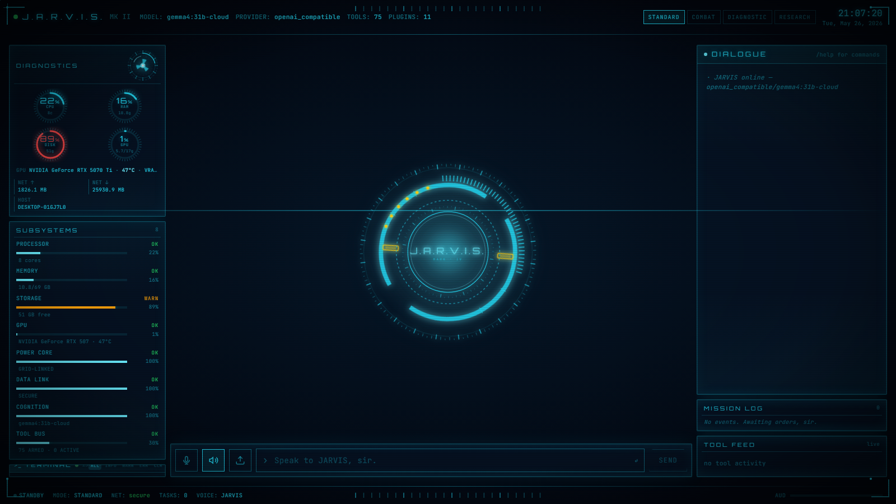
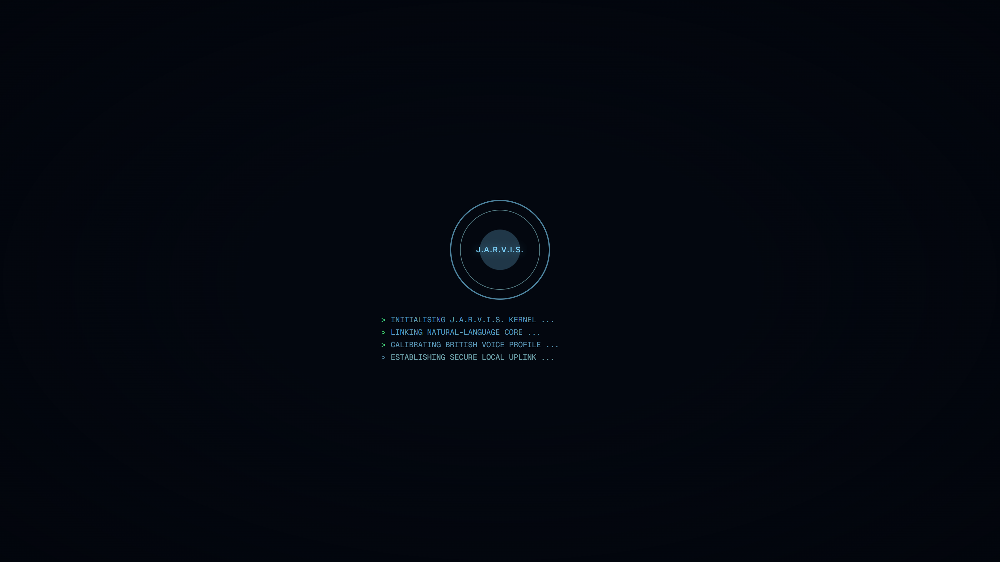
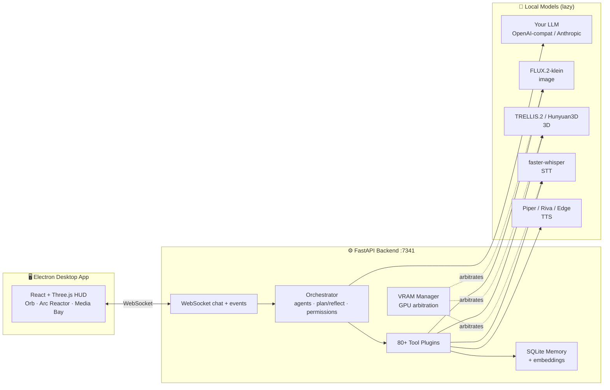

<div align="center">

# J.A.R.V.I.S.

### *Just A Rather Very Intelligent System* — your own local-first AI mission control.

A voice-driven assistant wrapped in an Iron-Man holographic HUD. It talks back in a
British butler voice, sees through your webcam, generates images **and** 3D models on
your own GPU, remembers everything across sessions, and commands your PC through
**80+ tools** — all running on your machine. No cloud required.

<br/>


<br/>

[](https://github.com/Dix01/JARVIS/stargazers)
&nbsp;&nbsp;
[](https://github.com/Dix01/JARVIS/fork)

**Your own Iron-Man AI — voice, vision, image + 3D gen, 80+ tools, 100% on your hardware.**
<br/>
[⭐ Star it](https://github.com/Dix01/JARVIS) if you'd run this on your machine.

<br/>



</div>

---

## ⚡ What is this?

J.A.R.V.I.S. is a **desktop AI command center** for Windows. Point it at any
OpenAI-compatible model (local or cloud), and you get a cinematic, full-screen
holographic interface that you talk to like Tony Stark talks to his lab.

It is **not** a chat box. It is a window manager built out of tools — every action
happens *inside* the UI. Ask it to generate an image and the picture materializes in
the Media Bay. Ask it to look at you and the webcam opens. Ask what it remembers and a
3D galaxy of your data unfolds. Say "Hey JARVIS" and it wakes; say "cancel" and it
stops talking.

```
You:    "Hey JARVIS, generate a chrome helmet on a black background, then make it 3D."
JARVIS: "Right away, sir."  →  FLUX renders the image  →  TRELLIS lifts it into a
        rotatable GLB hologram in the Media Bay. ~Seconds, fully local, on your GPU.
```

---

## 🌌 Why JARVIS?

Cloud assistants rent you intelligence and read your data. JARVIS doesn't.

- **🔒 100% local-first** — your voice, webcam, files, and memory never leave the machine. No telemetry, no account, no "your chats may be reviewed to improve our models."
- **💸 No subscription** — bring a model you already run (Ollama · LM Studio · vLLM) or a key you control. No monthly seat, no per-token meter.
- **🧰 It actually *does* things** — not a chat window. It runs code, drives a real browser, sees through your camera, generates images and 3D models, and remembers — across 80+ tools.
- **🎬 It feels like the films** — wake word, British-butler voice, holographic HUD, arc-reactor core. Built to be lived in, not just demoed once.
- **🪟 Yours to hack** — open, plugin-based, fully inspectable. Add a new tool in a single file.

> The whole point: an assistant as capable as the cloud ones — that you actually **own**.

---

## ✨ Highlights

|  |  |
|---|---|
| 🎙️ **Full voice loop** | Wake-word ("Hey JARVIS"), server-side Whisper STT, British-butler TTS, barge-in cancel, time-aware greetings. |
| 🧠 **Real memory** | Semantic cross-session recall via embeddings, notes, fixes, paths, prefs — visualized as a 3D **Neural Galaxy**. |
| 🖼️ **Local image gen** | **FLUX.2-klein-4B** (Q6_K GGUF, 4 steps) renders in seconds on a 16 GB GPU — no API, no watermark. |
| 🧊 **Local image→3D** | **TRELLIS.2-4B FP8** / **Hunyuan3D-2 mini** turn any image into a textured GLB, rendered inline. |
| 👁️ **Vision** | One-shot webcam analysis, live preview, screen capture, OCR, drag-and-drop image Q&A. |
| 🌐 **Web + browser** | Web/image/video search as cards, readable page fetch, and a *visible* Playwright-driven Chromium. |
| 🛠️ **Owns your PC** | Files, shell, PowerShell, Python/Node sandboxes, package installs, live CPU/GPU/RAM/disk/net telemetry. |
| 🤖 **Agent swarm** | A 9-role agent matrix with an autonomous plan→execute→reflect loop, plus delegation to Claude Code / Codex / OpenCode. |
| 🪟 **The HUD** | Arc-reactor core, voice-reactive orb, parallax depth, boot sequence, live terminal — React + Three.js. |
| 🔒 **Safe by design** | SAFE / CAUTION / DANGEROUS tool tiers, a hard denylist, action logs, and automatic edit backups. |

---

## 📸 Gallery

<div align="center">

<table>
<tr>
<td width="50%">



<sub>**Cold boot** — kernel init, natural-language core, British voice profile, secure local uplink.</sub>

</td>
<td width="50%">


<sub>**Full cockpit** — arc-reactor core, live subsystem telemetry, terminal + mission log, dialogue.</sub>

</td>
</tr>
</table>

</div>

---

## 🚀 Quick Start

> **Requirements:** Windows 10/11 · Python 3.10+ · Node 18+ · an NVIDIA GPU (recommended,
> for image/3D/Whisper) · and an LLM endpoint (e.g. [Ollama](https://ollama.com) or
> [LM Studio](https://lmstudio.ai) running locally — or an API key).

```bat
:: 1. Clone
git clone https://github.com/Dix01/JARVIS.git
cd JARVIS

:: 2. Install backend venv + frontend deps + Electron
setup.bat

:: 3. Configure
copy .env.example .env
notepad .env          :: put your API key(s) here (optional for local models)
notepad config.yaml   :: point `model.endpoint` at your LLM

:: 4. Launch
run.bat
```

Then open the desktop app (Electron) — or visit:

```
http://127.0.0.1:7341
```

Developing? `run-dev.bat` gives you hot-reload on the frontend.

> 💡 **No GPU?** It still runs. Image/3D/Whisper degrade gracefully and heavy models
> load lazily only when first used. Chat, web, memory, vision-via-API, and the full HUD
> work on any machine.

---

## 🧩 Configure the model

J.A.R.V.I.S. speaks to **any OpenAI-compatible `/v1` endpoint** *or* the Anthropic
Messages API. Edit `config.yaml`:

```yaml
model:
  provider: openai_compatible          # or: anthropic
  endpoint: http://localhost:11434/v1  # Ollama, LM Studio, vLLM, OpenRouter, OpenAI…
  model: your-model-name
  api_key_env: OLLAMA_API_KEY          # the .env variable to read the key from
  native_tool_calls: true
  temperature: 0.3
```

| Provider | `endpoint` example | Notes |
|---|---|---|
| **Ollama** | `http://localhost:11434/v1` | Free, local. Pull a tool-capable model. |
| **LM Studio** | `http://localhost:1234/v1` | Free, local, GUI. |
| **vLLM** | `http://localhost:8000/v1` | Self-hosted, fast. |
| **OpenRouter** | `https://openrouter.ai/api/v1` | Hundreds of models, one key. |
| **OpenAI** | `https://api.openai.com/v1` | GPT-4o etc. |
| **Anthropic** | *(set `provider: anthropic`)* | Claude via Messages API. |

For the best experience, pick a model with **strong native tool-calling**.

---

## 🎙️ Voice

A complete, hands-free loop — engineered to feel like the films:

- **Wake word** — say *"Hey JARVIS"* (fuzzy-matched, survives Whisper mishears like
  "jarvis / jervis / charvis"). A follow-up window keeps the mic armed so you don't
  repeat it every sentence.
- **Server-side STT** — [faster-whisper](https://github.com/SYSTRAN/faster-whisper) with
  VAD, hallucination filtering, and clip **coalescing** (a mid-sentence pause won't split
  your command into two).
- **"Mute mic except cancel"** — while JARVIS speaks, the mic is muted to commands; say
  **"cancel"** (or "stop talking", "nevermind") and the speech cuts instantly.
- **Time-aware greeting** — boots up with *"Good morning/afternoon/evening, sir."*
- **Cinematic TTS**, in priority order:

| Tier | Engine | Voice |
|---|---|---|
| 1 | **Piper** (local) | `jgkawell/jarvis` ONNX — closest to the Paul-Bettany MCU voice |
| 2 | **NVIDIA Riva** (cloud) | needs `NVIDIA_API_KEY` |
| 3 | **Edge TTS** (fallback) | `en-GB-ThomasNeural` / `RyanNeural` — deep British male |

The persona is a **concise British butler-AI**: status → diagnosis → recommended action.
Addresses you as "sir", anticipates the next step, never rambles.

---

## 🧠 Memory & Intelligence

Everything is stored **locally** in SQLite — nothing leaves your machine.

- **Semantic recall** — embeddings (e.g. `nomic-embed-text`) give true cross-session
  memory; gracefully falls back to keyword search if embeddings are unavailable.
- **Stores** preferences, free-form notes, known fixes for recurring errors, labeled
  paths, installed tools, and your most-used commands.
- **Neural Galaxy** — say *"show me what you remember"* and your entire memory store
  blooms as an interactive 3D point cloud, clustered by category.
- **Context compaction** keeps long sessions coherent without blowing the token budget.
- **Autonomous planning** — for complex goals, JARVIS runs a **plan → execute → reflect**
  loop, surfaced live in the Plan panel.
- **Proactive suggestions** — after each action it offers the next likely step.

All of the above is toggleable under `ultimate:` in `config.yaml`.

---

## 🖼️ Local Media Generation

### Images — FLUX.2-klein-4B
Black Forest Labs' fastest distilled model, run from a **Q6_K GGUF** (~3.3 GB on disk):

- 4-step rectified-flow → **seconds per image** on a 16 GB GPU
- Smart `model_cpu_offload` keeps the ~8 GB text encoder from over-committing VRAM
  (no silent PCIe sysmem spill = no 100× slowdowns)
- Apache 2.0 — yours to use
- Just say *"generate / draw / render an image of …"* — the picture lands in the Media Bay

### 3D — TRELLIS.2 / Hunyuan3D
Turn **any** image (generated, webcam, or uploaded) into a **textured GLB**:

- **TRELLIS.2-4B FP8** in an isolated Python 3.12 worker (quantized, high quality, ungated)
- **Hunyuan3D-2 mini turbo** (0.6 B) as a compact local shape path
- `text_to_3d` (prompt → image → model in one shot) or `image_to_3d`
- Renders inline in the Media Bay via `<model-viewer>` — rotate, zoom, inspect

The VRAM manager automatically evicts FLUX and Whisper from the GPU before a 3D job
takes over, so everything coexists on a single card.

---

## 🛠️ The Tool Belt

~80 tools across 12 plugin groups. JARVIS picks the right one automatically.

<details>
<summary><b>📁 Files &amp; Code</b></summary>

`list_dir` · `read_file` · `write_file` (auto-backup) · `append_file` · `search_files` ·
`mkdir` · `copy` · `move` · `delete` · `stat` · `run_python` · `run_python_file` ·
`run_node` · `pip_install` · `npm_install` · `scan_project` · `code_debug_loop`
</details>

<details>
<summary><b>💻 Shell &amp; System</b></summary>

`run_shell` · `run_powershell` · `which` · `env_var` · `system_status` ·
`list_processes` · `network_info` · `battery` · `gpu_info` · `disk_usage` · `kill_process`
</details>

<details>
<summary><b>🌐 Web &amp; Browser</b></summary>

`web_search` · `image_search` · `video_search` · `web_fetch` · `open_inline` ·
`media_show` · `browser_open` · `browser_search` · `browser_page_text` ·
`browser_click_text` · `browser_type` · `browser_press` · `browser_screenshot` ·
`browser_close` *(visible Playwright Chromium)*
</details>

<details>
<summary><b>👁️ Vision</b></summary>

`webcam_see` (snapshot + multimodal analysis) · `webcam_show` (live preview) ·
`webcam_snapshot` · `screenshot` · `screen_ocr` · `ocr_image` · `analyze_image` ·
`webcam_status`
</details>

<details>
<summary><b>🧠 Memory</b></summary>

`remember` · `recall` · `forget` · `list_prefs` · `add_note` · `list_notes` ·
`search_memory` · `set_path` · `get_path` · `list_paths` · `record_tool` ·
`list_tools` · `add_fix` · `lookup_fix` · `top_commands` · `memory_galaxy`
</details>

<details>
<summary><b>🎨 Media &amp; Agents</b></summary>

`image_generate` · `image_to_3d` · `text_to_3d` · `agent_backend_run`
(delegate to Claude Code / Codex / OpenCode) · plus optional `speak` · `listen` ·
`send_email` · `add_event` · Home-Assistant smart-home control
</details>

---

## 🤖 Agent Swarm

Behind the butler sits a **9-role agent matrix**, visible in the Swarm panel:

```
Planner → Executor → Research → Code → File → System → Memory → Vision → Voice
```

For long-running goals ("run until you finish X"), JARVIS delegates to installed
CLI backends — **Claude Code**, **Codex**, or **OpenCode** — and streams their progress
straight into the HUD.

---

## 🪟 The HUD

A genuinely cinematic interface, not a reskin of a chat window:

- **Arc-reactor core** + concentric **reactive rings** that pulse with JARVIS's voice
- **Voice-reactive orb** driven by live mic amplitude
- **Boot sequence** on every launch (kernel init → voice profile → uplink → ready)
- **Live panels** — subsystems telemetry, terminal feed, system log, mission log,
  ambient telemetry, plan + swarm status
- **Media Bay** — image cards, embedded video, inline web pages, article reader,
  3D model viewer, webcam feed, lightbox
- **Mouse-parallax depth** so the whole HUD floats in 3D space

Built with **React 18 · TypeScript · Three.js** (`@react-three/fiber` + `drei`) ·
**Framer Motion · Zustand · TailwindCSS · Vite · Electron**.

---

## 🏗️ Architecture



---

## 🔒 Safety Model

Every tool is tiered and gated:

| Tier | Behavior |
|---|---|
| 🟢 **SAFE** | Read-only / low-risk — runs automatically. |
| 🟡 **CAUTION** | Needs confirmation. |
| 🔴 **DANGEROUS** | Explicit approval, or refused outright. |

- A hard **denylist** blocks catastrophic commands (`rm -rf /`, `format c:`, fork bombs…)
  regardless of mode.
- Every action is logged to `data/logs/actions.jsonl`.
- Every file edit is **backed up** under `data/backups/` (keeps the last 50).
- Permission posture is configurable: `safe` · `confirm` · `auto` · `bypass`.

> ⚠️ This is a powerful local agent with real access to your machine. Review the
> permission mode in `config.yaml` before pointing it at sensitive files or systems.

---

## ⌨️ Command Bar

```
/help        Show commands              /memory ...  Search local memory
/tools       List all tools            /mission ... Pin a project as focus
/agents      List agent personas       /reset       Clear the in-memory chat
```

---

## 📦 Model Assets

Large weights are **not** committed — they download lazily on first use. See the
[**Model Asset Guide**](docs/MODEL_ASSETS.md).

- FLUX GGUF → `data/models/`
- Piper voice → `data/voices/` ([jgkawell/jarvis](https://huggingface.co/jgkawell/jarvis))
- TRELLIS.2 / Hunyuan3D → auto-fetched into `data/models/` by their workers

---

## 🗂️ Project Layout

```
jarvis/        Python backend — server routes, orchestrator, agents, tool plugins
web/           React + Three.js HUD frontend
electron/      Desktop shell
docs/          Model download guide, research notes, screenshots
data/          Local runtime state — memory.db, logs, backups, generated media (git-ignored)
config.yaml    All configuration (persona, model, voice, permissions, plugins)
.env           Secrets (git-ignored)
```

---

## 🛣️ Roadmap / Ideas

- [ ] Linux / macOS launch scripts
- [ ] More image models in the command-bar switcher
- [ ] Voice-cloning for a fully custom TTS profile
- [ ] Plugin marketplace / hot-reload

---

## 🤝 Contributing

JARVIS thrives on community tools. **Adding a new capability is ~30 lines in a single
file** — drop a module in `jarvis/plugins/` and the registry auto-discovers it on boot.
See **[CONTRIBUTING.md](CONTRIBUTING.md)** for the 5-minute tool tutorial, dev setup, and
the safety rules.

Good first contributions: a new tool, a HUD panel, another model/voice backend, or docs.

[](CONTRIBUTING.md)
[](https://github.com/Dix01/JARVIS/labels/good%20first%20issue)

---

## ⭐ Star History

If JARVIS made you smile, a star helps the next person building their own lab find it.

<div align="center">

<a href="https://star-history.com/#Dix01/JARVIS&Date">
  
</a>

<br/><br/>

**Spread the word →**
[Share on X](https://twitter.com/intent/tweet?text=JARVIS%20%E2%80%94%20a%20100%25%20local%20Iron-Man%20AI%20with%20voice%2C%20vision%2C%20image%20%2B%203D%20generation%20and%2080%2B%20tools.%20Runs%20on%20your%20own%20GPU.&url=https://github.com/Dix01/JARVIS)
·
[Reddit](https://www.reddit.com/submit?url=https://github.com/Dix01/JARVIS&title=JARVIS%20%E2%80%94%20a%20fully%20local%20Iron-Man%20AI%20assistant)
·
[Hacker News](https://news.ycombinator.com/submitlink?u=https://github.com/Dix01/JARVIS&t=JARVIS%20%E2%80%94%20a%20fully%20local%20Iron-Man%20AI%20assistant)

</div>

---

<div align="center">

**Built for the lab. Powered by your own hardware.**

*"Subsystems nominal. Standing by, sir."*

</div>
